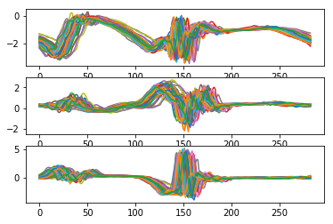
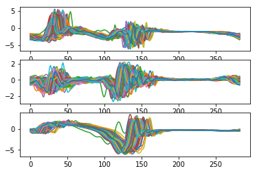
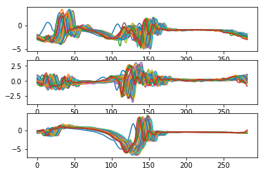
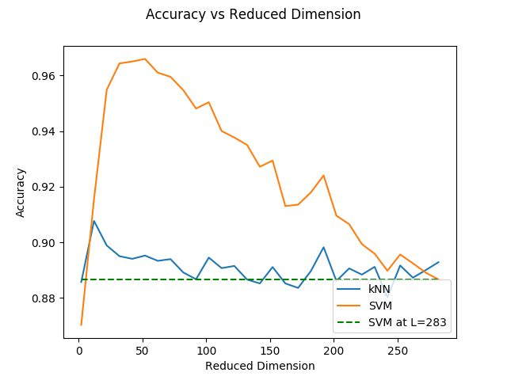
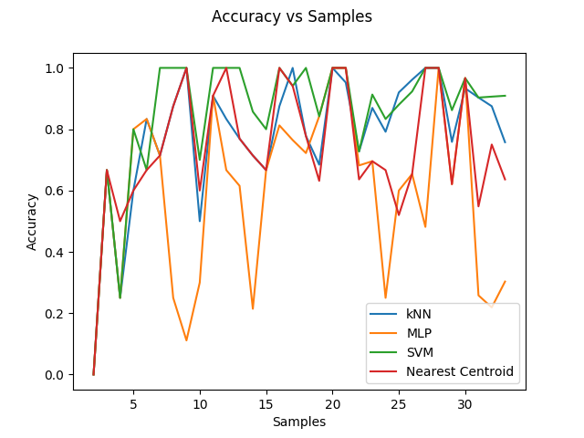

# Tensor Decomposition for Gaits

A Python package for injury recovery prediction using tensor decomposition methods on gait data. This project applies Tucker decomposition to tri-axial accelerometer readings from heel-mounted sensors to classify gait patterns at different stages of injury recovery (10%, 50%, and 95% recovered).

## Overview

This repository implements tensor decomposition-based feature extraction for gait analysis. The method uses Tucker decomposition to reduce the dimensionality of gait tensor data, followed by machine learning classifiers (kNN, MLP, SVM) to predict injury recovery stages.

### Key Features

- **Tucker Decomposition**: Dimensionality reduction using tensor decomposition
- **Multiple Classifiers**: k-Nearest Neighbors (kNN), Multi-Layer Perceptron (MLP), and Support Vector Machine (SVM)
- **Comprehensive Experiments**: Three different experimental setups evaluating accuracy vs. reduced dimension, vs. samples, and combined analysis
- **Reproducible Results**: Configurable parameters and statistical evaluation over multiple realizations

## Dataset

The dataset consists of three classes, each representing a different stage of injury recovery:
- **10% recovered**: Early stage recovery data
- **50% recovered**: Mid-stage recovery data  
- **95% recovered**: Late-stage recovery data

Each class contains tri-axial accelerometer readings from sensors mounted on the heel of subjects during walking. The data is organized as tensors stored in `.mat` files:
- `recovered10.mat`: 10% recovery stage data
- `recovered50.mat`: 50% recovery stage data
- `recovered95.mat`: 95% recovery stage data

Each tensor has shape `(num_samples, 3, 283)` where:
- `num_samples`: Number of gait samples
- `3`: Tri-axial accelerometer dimensions (X, Y, Z)
- `283`: Number of time points per sample

### Sample Data Visualization

<p align="center">
    
</p>

*Fig. 1: Recovered - 10% data. Subplot 1: X axis, subplot 2: Y axis, subplot 3: Z axis. On the x axis of each subplot are data points. On the y axis of each plot is acceleration (g).*

<p align="center">
    
</p>

*Fig. 2: Recovered - 50% data. Subplot 1: X axis, subplot 2: Y axis, subplot 3: Z axis. On the x axis of each subplot are data points. On the y axis of each plot is acceleration (g).*

<p align="center">
    
</p>

*Fig. 3: Recovered - 95% data. Subplot 1: X axis, subplot 2: Y axis, subplot 3: Z axis. On the x axis of each subplot are data points. On the y axis of each plot is acceleration (g).*

## Method

### Tensor Decomposition

The method uses **Tucker decomposition** to extract features from gait tensors. Tucker decomposition factorizes a tensor into a core tensor and factor matrices:

```
T ≈ Core ×₁ U₁ ×₂ U₂ ×₃ U₃
```

where:
- `T` is the input tensor
- `Core` is the core tensor
- `U₁, U₂, U₃` are factor matrices for each mode
- `×ᵢ` denotes mode-i product

For this application, the decomposition reduces the tensor from shape `(samples, 3, 283)` to `(samples, l)` where `l` is the reduced dimension parameter.

### Classification

After decomposition, the reduced features are used to train classifiers:
- **kNN**: k-Nearest Neighbors classifier (k=3)
- **MLP**: Multi-Layer Perceptron with multiple hidden layers
- **SVM**: Support Vector Machine with RBF kernel

## Installation

### Requirements

- Python 3.10 or higher
- pip

### Setup

1. Clone this repository:
```bash
git clone https://github.com/kbichave/tensor-decomposition-for-gaits.git
cd tensor-decomposition-for-gaits
```

2. Install the package and dependencies:
```bash
pip install -e .
```

### Development Setup

For development with additional tools:
```bash
pip install -e ".[dev]"
```

## Usage

The package provides three main experiments accessible via command-line interface:

### 1. Accuracy vs Reduced Dimension

Evaluates classification accuracy as a function of the reduced dimension parameter `l`:

```bash
python main.py --dimension
```

This experiment:
- Varies reduced dimension from 2 to 283 (step 10)
- Uses 20 training samples and 10 test samples per class
- Runs 600 random realizations for statistical significance
- Evaluates kNN and SVM classifiers

### 2. Accuracy vs Samples

Evaluates classification accuracy as a function of the number of training samples:

```bash
python main.py --samples
```

This experiment:
- Varies training samples from 2 to 23
- Uses fixed reduced dimension of 11
- Uses 10 test samples per class
- Runs 600 random realizations
- Evaluates kNN, MLP, and SVM classifiers

### 3. Combined Analysis

Evaluates accuracy as a function of both reduced dimension and number of samples:

```bash
python main.py --all
```

This experiment:
- Sweeps over reduced dimension (2 to 283, step 10) and samples (2 to 29)
- Uses 4 test samples per class
- Runs 500 random realizations
- Evaluates kNN, MLP, SVM, and Nearest Centroid classifiers
- Generates 3D surface plots

### Custom Data Directory

To specify a custom data directory:

```bash
python main.py --samples --data-dir /path/to/data
```

## Results

### Accuracy vs Reduced Dimension

<p align="center">
    
</p>

*Fig. 4: Accuracy vs Reduced Dimension | Number of training samples per class: 20, Number of test samples per class: 4, Number of realizations: 600.*

### Accuracy vs Samples

<p align="center">
    
</p>

*Fig. 5: Accuracy vs Samples | Number of training samples increased from 2 to 23, Number of test samples: 10, Reduced dimension l = 11.*

## Project Structure

```
tensor-decomposition-for-gaits/
├── Data/                          # Data directory
│   ├── recovered10.mat           # 10% recovery data
│   ├── recovered50.mat           # 50% recovery data
│   └── recovered95.mat           # 95% recovery data
├── experiments/                   # Experiment modules
│   ├── __init__.py               # Package initialization
│   ├── base.py                   # Base TensorExperiment class
│   ├── acc_vs_rd.py             # Accuracy vs reduced dimension
│   ├── acc_vs_samples.py        # Accuracy vs samples
│   └── acc_vs_rd_vs_samples.py  # Combined experiment
├── Figures/                      # Generated figures
├── main.py                       # Main entry point
├── pyproject.toml                # Project configuration
├── LICENSE                       # MIT License
└── README.md                     # This file
```

## Classifiers

The following classifiers are used in the experiments:

- **[Multi-Layer Perceptron (MLP)](https://scikit-learn.org/stable/modules/generated/sklearn.neural_network.MLPClassifier.html)**: Neural network with multiple hidden layers for non-linear approximation
- **[k-Nearest Neighbors (kNN)](https://scikit-learn.org/stable/modules/generated/sklearn.neighbors.KNeighborsClassifier.html)**: Distance-based classifier using k nearest neighbors
- **[Support Vector Machine (SVM)](https://scikit-learn.org/stable/modules/svm.html)**: Kernel-based classifier for non-linear separation
- **[Nearest Centroid](https://scikit-learn.org/stable/modules/generated/sklearn.neighbors.NearestCentroid.html)**: Simple centroid-based classifier (used in combined experiment)

## Citation

If you use this code in your research, please cite:

```bibtex
@software{tensor_decomposition_gaits,
  title = {Tensor Decomposition for Gaits},
  author = {Bichave, Kshitij},
  year = {2024},
  url = {https://github.com/kbichave/tensor-decomposition-for-gaits}
}
```

### Related Work

- **Tucker Decomposition**: Tucker, L. R. (1966). Some mathematical notes on three-mode factor analysis. Psychometrika, 31(3), 279-311.
- **TensorLy**: Kossaifi, J., Panagakis, Y., Anandkumar, A., & Pantic, M. (2019). TensorLy: Tensor learning in Python. Journal of Machine Learning Research, 20(26), 1-6.

## License

This project is licensed under the MIT License - see the [LICENSE](LICENSE) file for details.

## Contributing

Contributions are welcome! Please feel free to submit a Pull Request.

## Author

**Kshitij Bichave**

## Acknowledgments

- Dr. Ivan Puchades and Tristan Scott for dataset preparation and methodology discussions
- TensorLy library by Dr. Anima Anandkumar and group
- SPAN-PACER Lab for research support
